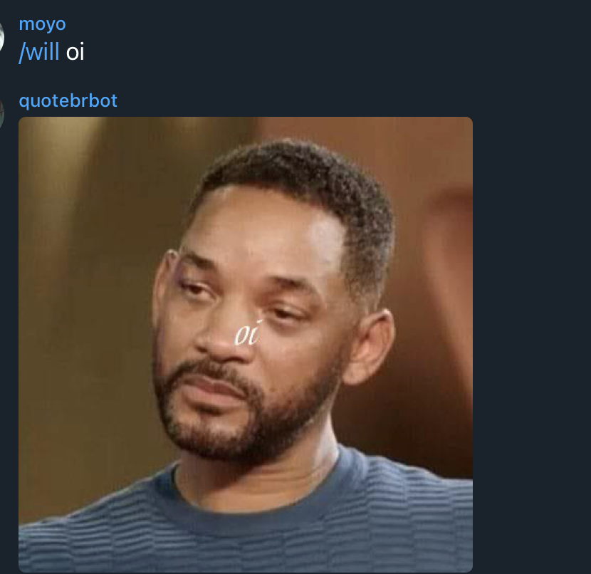

# quotebrbot
generate images with text

# how to add options
add the image file on `/assets/images` without the extension on file name. ex: `will.png` -> `will`.
the image name will be the command name on the bot

# deployment
update `main` branch